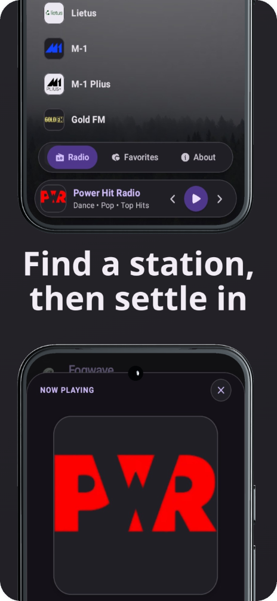
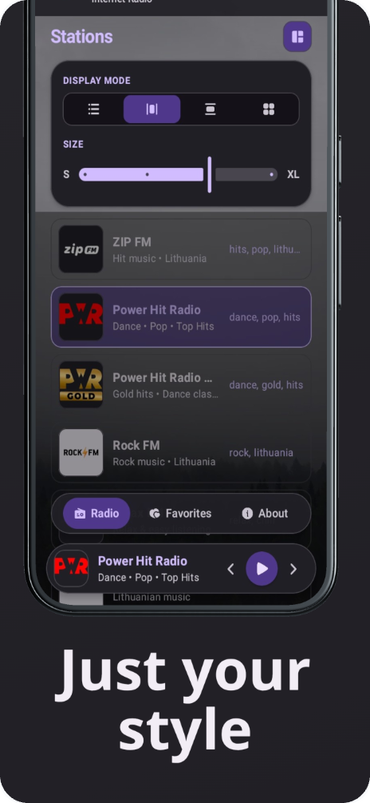
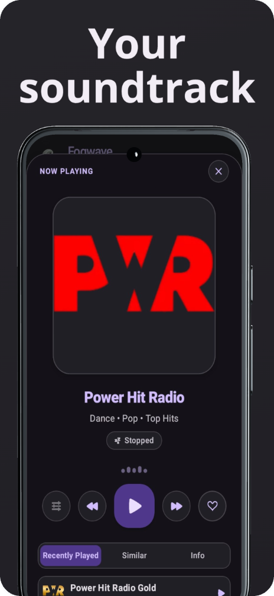

<p align="center">
  
</p>

<h1 align="center">Fogwave</h1>

<p align="center">
  <a href="https://git.skysparkle.cc/kalarina/Fogwave/releases"></a>
</p>

<p align="center">
  
</p>

**A calm, open-source internet radio app for Android.**

Listen to Lithuania's favorite stations in one tap — with background playback, a built-in equalizer, and a clean, distraction-free design.

## Features

- 📻 **10 Lithuanian stations** — ZIP FM, Power Hit Radio, Rock FM, Relax FM, M-1, Gold FM and more
- 🎧 **Background playback** with lock-screen, notification, headphone and Bluetooth controls
- 🚗 **Android Auto** support
- 🔄 **Auto-reconnect** when the stream drops or the network comes back
- 🎚️ **Equalizer** with presets, loudness boost and dynamics processing — settings are saved
- ❤️ **Favorites, recently played and similar stations** matched by genre
- 🗂️ **Four layouts** — list, table, tiles or icons, with adjustable size
- 🌙 **Clean, elegant UI** in a dark theme
- 🌍 Available in English, Russian, German, Japanese, Lithuanian, and Chinese
- 🔓 **100% open source** — no ads, no tracking, no accounts

## Screenshots

<p align="center">
  
  
  
  
  
</p>

## Installation


1. Download the APK for the version you want from the [Releases page](https://github.com/kalarina-bit/Fogwave/releases).
2. On your Android device, allow installs from unknown sources for the app you use to open the file (Settings → Apps → Special access → Install unknown apps).
3. Open the downloaded `.apk` file and confirm the install.

Or via `adb` (after downloading):

```sh
adb install Fogwawe-v1.0.10.apk
```

## Verifying a download


Compare the SHA-256 checksum against the value listed in [CHANGELOG.md](CHANGELOG.md):

```sh
sha256sum Fogwawe-v1.0.10.apk
```

## Building from source

Requires JDK 17+ and Android Studio with Android SDK 37.

```sh
./gradlew assembleDebug
```

Release builds are signed only when a keystore is supplied through the `KEYSTORE_PATH`, `STORE_PASSWORD`, `KEY_ALIAS` and `KEY_PASSWORD` environment variables. Without them the release build is unsigned, which is what F-Droid expects. Keystores are excluded by `.gitignore` — never commit them.

For every release: bump `versionCode` and `versionName` in `app/build.gradle.kts`, add `fastlane/metadata/android/<locale>/changelogs/<versionCode>.txt`, and tag the commit as `v<versionName>` (for example `v1.0.11`).

## Repository structure


```
.
├── app/                 # Android app source (Kotlin, Jetpack Compose)
├── assets/              # README images and logos
│   └── screenshots/     # App screenshots
├── fastlane/            # F-Droid store listing, screenshots and changelogs
├── fdroid/              # Build recipe for fdroiddata
├── gradle/              # Gradle wrapper and version catalog
├── CHANGELOG.md         # Per-version sizes and checksums (links to GitHub Releases)
├── LICENSE              # GNU GPLv3
└── README.md
```

APK builds themselves are published as assets on the [Releases page](https://github.com/kalarina-bit/Fogwave/releases), not stored in this repository.

## License

This project is licensed under the **GNU General Public License v3.0** — see the [LICENSE](LICENSE) file for details.
